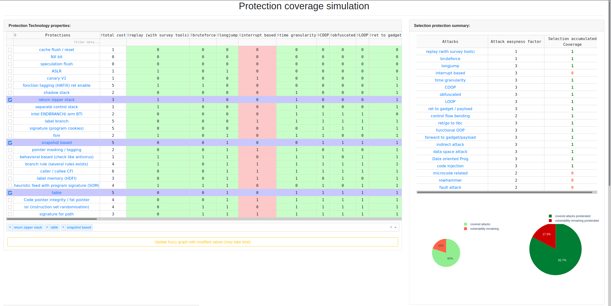

# security-modeling-sys-dash


## Introduction
`security-modeling-sys-dash` is a dashboard for monitoring real-time a security system properties along to thousands of others. 
This is part of a PHD work. It been made by [Antoine Linarès](mailto:antoine.linares@sifive.com)

## Screenshots



## Built With
* [Dash](https://dash.plot.ly/) - Main server and interactive components 
* [Plotly Python](https://plot.ly/python/) - Used to create the interactive plots
* [Dash DAQ](https://dash.plot.ly/dash-daq) - Styled technical components for industrial applications

## Requirements
We suggest you to create a separate virtual environment running Python 3 for this app, and install all of the required dependencies there. Run in Terminal/Command Prompt:

```
git clone "this repo"
cd "this repo"
python3 -m virtualenv venv
```
In UNIX system: 

```
source venv/bin/activate
```
In Windows: 

```
venv\Scripts\activate
```

To install all of the required packages to this environment, simply run:

```
pip install -r requirements.txt
```

and all of the required `pip` packages, will be installed, and the app will be able to run.


## How to use this app

Run this app locally by:
```
python CFIserver.py
```
Open http://0.0.0.0:8050/ in your browser, you will see a live-updating dashboard.

## What does this app show

Select using checkboxes or the dropdown some security techniques: magic happened and you can see several properties of the security system you've made.

These properties are computed from the main tab in center. You can change these in order to describe a protection of your's.

Then you can change the factor of cost and "attack easyness factor" that give you the ability to push forward protections against some specific attacks.

Below you have a 3D graph that represent several propositions next to yours. 

This chart is a result from a fuzzing campain and may not suggest the best solution for you! 
So to make theses propositions follow the rules you may have changed click the update button and wait.

merge request are welcome.

## Resources and references
* [Dash User Guide](https://dash.plot.ly/)
